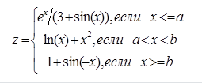
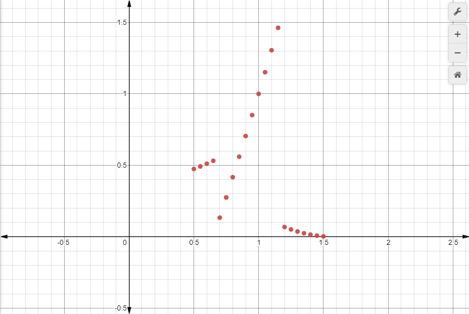

МИНИСТЕРСТВО НАУКИ  И ВЫСШЕГО ОБРАЗОВАНИЯ РОССИЙСКОЙ ФЕДЕРАЦИИ  

Федеральное государственное автономное образовательное учреждение высшего образования  

"КРЫМСКИЙ ФЕДЕРАЛЬНЫЙ УНИВЕРСИТЕТ им. В. И. ВЕРНАДСКОГО"  

ФИЗИКО-ТЕХНИЧЕСКИЙ ИНСТИТУТ  

Кафедра компьютерной инженерии и моделирования
<br/><br/>
### Отчёт по лабораторной работе № 2<br/> по дисциплине "Программирование"
<br/>
​Cтудента 1 курса группы ПИ-б-о-192(1)<br/>
Гусько Елизавета Викторовна<br/>
направления подготовки 09.03.04 "Программная инженерия"  
<br/>


<br/>
<table>

<tr><td>Научный руководитель<br/> старший преподаватель кафедры<br/> компьютерной инженерии и моделирования</td>

<td>(оценка)</td>

<td>Чабанов В.В.</td>

</tr>

</table>

<br/><br/>

​

Симферополь, 2019

<br/>

# Лабораторная работа №2

# Табулирование кусочно-заданной функции

### ***Цель***: 
1. Овладеть практическими навыками разработки и программирования вычислительного процесса циклической структуры;
2. Сформировать навыков программирования алгоритмов разветвляющейся структуры;
3. Изучить операторы ветвления. Особенности использования полной и сокращенной формы оператора *if* и тернарного оператора.

<br/>

### ***Постановка задачи***
Напишите на языке С++ программу которая для функции ***f(x)*** на интервале **x** ∈ [**X**нач; **X**кон]:<br/>
* Выводит в консоль значения функции ***f(x)*** с шагом ***dx***;
* Определяет максимальное и минимальное значение функции. 
<br/>

Значения параметров **a**, **b**, начала и конца интервала **Xнач**, **Xкон** и шага ***dx*** вводятся пользователем. 

Для соответствующей функции выполните следующие действия:

1. Протабулируйте функцию и запишите получившиеся реультаты в отчёт в виде таблицы. При этом **a** = 0.7, **b** = 1.2, начала и конца интервала **Xнач** = 0.5, **Xкон** = 1.5 и шага ***dx*** = 0.05;
2. Определите минимальное и максимальное значение функции на указанном интервале.
* постройте график функции;
* добавьте на график точки, которые у вас получились в процессе табуляции;
* добавьте на график точки минимума и максимума с метками значений;

Дана функция <br/> 
<br/>
При ручном вводе данных код данной функции будет выглядеть так: 
```
    #include <iostream>
    #include <math.h>
    #include <stdio.h>
    using namespace std;
    int main() {
	double x1, x2, dx, a, b, z;
	cout << "enter the data: xmin = ";
	    cin >> x1;
    cout << "\nxmax = ";
        cin >> x2;
    cout << "\ndx = ";
        cin >> dx;
	cout << "\na = ";
	    cin >> a;
	cout << "\nb = ";
	    cin >> b;
    for (double x1 = x1; x1 <= x2; x1+=dx){

	    if (x1 < a && x1-a < 1e-10) { z = exp(x1) / (3 + sin(x1)); }

	    else if (a < x1 && x1 < b) { z = log(x1) + pow(x1, 2); }

	    else if (x1 > b && b-x < 1e-10) { z = 1 + sin(-x1); }

    cout << "\nx = " << x1;
	cout << "\nz = " << z; } }
```

<br/>Так как нам задали параметры в тз наш код будет выглядеть так:
```
    #include <iostream>
    #include <math.h>
    #include <stdio.h>
    using namespace std;
    int main()
    {
	    double x, a, b, z;
	    a = 0.7;
	    b = 1.2;
	    for (double x = 0.5; x <= 1.51; x+=0.05)
	    {
		    if (x < a && x-a < 1e-10)
		    {
			    z = exp(x) / (3 + sin(x)); 
		    }
		    else if (x > a && x < b) 
		    { 
			    z = log(x) + pow(x, 2);
		    }
		    else if (x > b && b-x < 1e-10)
		    {
			    z = 1 + sin(-x);
		    }
		    cout << "\nx = " << x;
		    cout << "\nz = " << z;
	    }
    }
```
<table>
<tr><td> x <td>
<td> 0.5 <td>
<td> 0.55 <td>
<td> 0.6 <td>
<td> 0.65 <td>
<td> 0.7 <td>
<td> 0.75 <td>
<td> 0.8 <td>
<td>0.85<td>
<td>0.9<td>
<td>1<td>
<td>1.05<td>
<td>1.1<td>
<td>1.15<td>
<td>1.2<td>
<td>1.25<td>
<td>1.3<td>
<td>1.35<td>
<td>1.4<td>
<td>1.45<td>
<td>1.5<td> 
</tr>

<tr><td> z <td>
<td>0,473849<td>
<td>0,492026<td>
<td>0,511165<td>
<td>0,531329<td>
<td>0,133325<td>
<td>0,274818<td>
<td>0,416856<td>
<td>0,559981<td>
<td>0,704639<td>
<td>0,851207<td>
<td>1<td>
<td>1,15129<td>
<td>1,30531<td>
<td>1,46226<td>
<td>0,0679609<td>
<td>0,0510154<td>
<td>0,0364418<td>
<td>0,0242766<td>
<td>0,0145503<td>
<td>0,00728701<td>
<td>0,00250501<td>
</tr>

</table>
<br/> График к данному коду выглядит примерным образом: 
<br/>

 

### Вывод: в ходе выполнения данной лабораторной работы я смогла овладеть практическими навыками разработки и программирования вычислительного процесса циклической структуры; также сформировала некоторые навыки программирования алгоритмов разветвляющейся структуры; изучила операторы ветвления.
